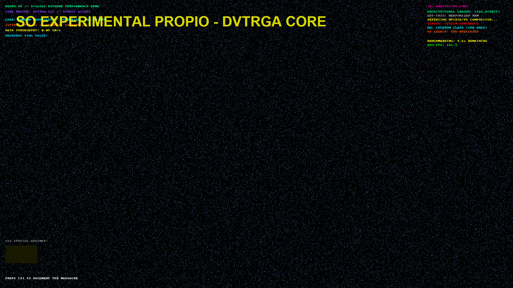
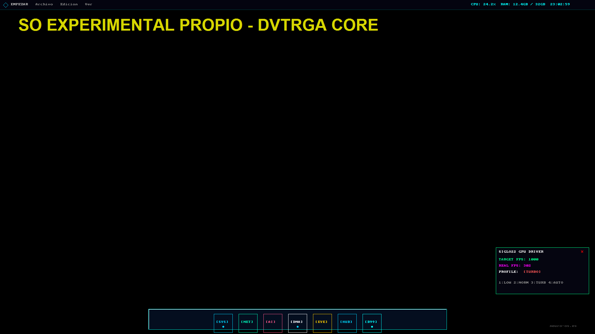

This report documents the performance milestones achieved using the core **DVTRGA** graphics engine.

> [!IMPORTANT]
> **Performance Context**: These results were obtained while running the engine on **Windows 11** as a host. As a non-native environment, Windows 11 introduces significant compositor overhead and system-level latency that limits the engine's true physical potential. In its **Native Experimental OS** environment, current architecture targets are significantly higher.

## Key Technical Milestones
*   **Isolated Driver Testing**: Standalone benchmarking was performed to measure pure rendering overhead without interference from system-level processes.
*   **Memory Throughput Optimization**: Zero-copy texture updates were implemented to maximize transfer efficiency between host memory and the display buffer.
*   **High-Precision Timing**: Windows timer resolution was increased to 1 ms to ensure accurate frame pacing at framerates above 100 FPS.
*   **V-Sync Decoupling**: Hardware synchronization was disabled to expose the true physical throughput of the rendering pipeline.

## Performance Analysis: Stress Test Benchmark
A high-load benchmark was executed to evaluate the engine’s behavior under extreme pixel throughput (1,000,000 active particles).

### Results
| Metric | Value |
| :--- | :--- |
| **Average Performance** | 151.7 FPS |
| **Load Density** | 1,000,000 Particles / Frame |
| **Data Throughput** | 8.85 GB/s (Measured on Win11 Host) |
| **Target Environment** | Intel Celeron (CPU-only, no GPU) |

*1,000,000 Particles / 151.7 FPS (Captured in Experimental Custom OS environment).*

*These results confirm that the driver maintains stability even under unusually heavy workloads, despite the host OS limitations.*

## Desktop Performance Results
The base driver was integrated into the primary desktop environment to measure real-world responsiveness.

| Scenario | Performance |
| :--- | :--- |
| **Desktop Baseline (Win11 Host)** | **302 FPS** (Limit Hit) |
| **Dynamic Simulation (Parallax)** | **243+ FPS** |

*Sustained 302 FPS Milestone in Experimental System mode.*

*These values demonstrate that the driver performs consistently even when sandboxed within a standard consumer OS like Windows 11.*

## Diagnostic & Test Modes
The benchmark suite includes several modes designed to isolate specific rendering bottlenecks:

| Mode ID | Mode Name | Purpose | Expected Result |
| :--- | :--- | :--- | :--- |
| **0** | **Null Driver** | Measures raw SDL and hardware overhead | 1000+ FPS |
| **1** | **Desktop Baseline** | Standard OS interface rendering | 300+ FPS |
| **8** | **Simulation** | Multi-layer parallax and physics simulation | 240+ FPS |
| **9** | **Stress Test** | Extreme throughput (1M particles per frame) | 150+ FPS |

## Optimization Summary
To achieve these results, the following standard techniques were applied:

1.  **Localized Region Updates**: Only modified screen regions are cleared and redrawn, significantly reducing memory bandwidth usage.
2.  **Resource Budgeting**: Visual effects are processed on a staggered schedule to maintain a stable framerate budget.
3.  **Direct Memory Access**: Intermediate buffer copies were minimized to streamline the critical rendering path.

## Conclusion
The results demonstrate that a well-designed, software-only rendering pipeline can achieve high framerates even on low-power hardware. The system remains stable and responsive at throughputs exceeding 8 GB/s, confirming the architectural validity and efficiency of the base **DVTRGA** driver.
