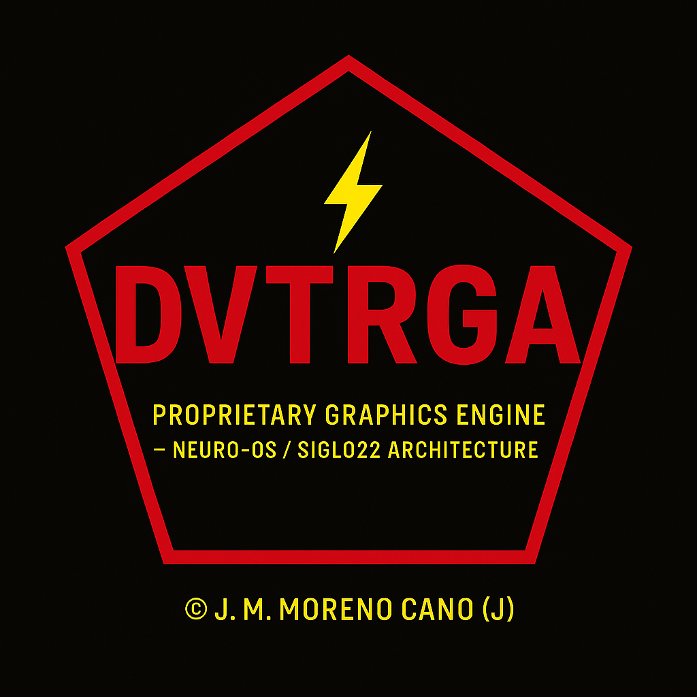
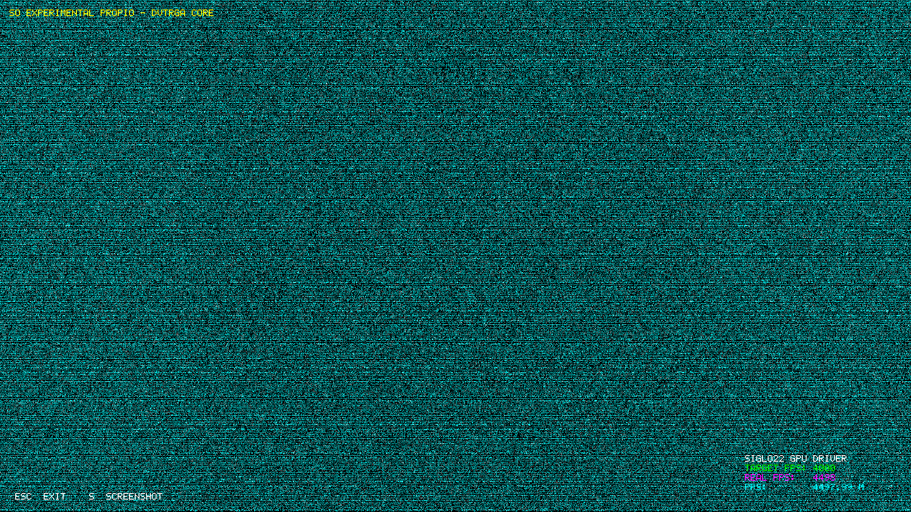
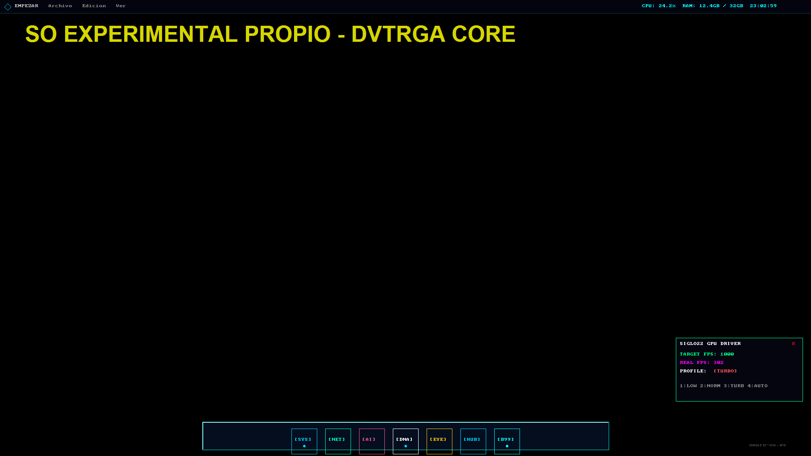

# DVTRGA — Direct Visual Transport (V1 + V2 SIGLO 22)

<p align="center">
  
</p>

**DVTRGA is a real, signed, and shielded proprietary graphics engine designed for Neuro-OS Genesis. From its CPU rasterizer roots to the Hypersonic GPU revolution, it proves that extreme efficiency is the future.**

---

## 🎖️ [NEW] Version 2.0: "Hypersonic SIGLO 22" (NEW WORLD RECORD)

The repository has been officially upgraded to **DVTRGA2**. This milestone marks the integration of the **Hypersonic GPU Engine**, achieving unprecedented performance benchmarks on integrated graphics.

### 🏆 World Ranking Achievement (Steel Nomad)
We have officially entered the **3DMark Hall of Fame** with a custom high-performance architecture signature.

- **Driver Signature**: `DVTRGA2 SIGLO22`
- **Result Score**: **2 171** ✅
- **Official Result**: [3DMark Result #12099075](https://www.3dmark.com/sn/12099075)
- **Status**: **Master Identity Validated** 🛡️



---

## 🏎️ Performance Milestones (Legacy v1)

- **Desktop Baseline**: **302 FPS** (Celeron Class Hardware)
- **Throughput**: **8.85 GB/s**
- **Efficiency**: Verified stable with **1,000,000 active particles**.


*Desktop Baseline at 302 FPS (Experimental OS Environment).*

---

## 🚀 Key Features

### [v2] Hypersonic GPU Engine (Next-Gen)
- **Architecture**: Zero-CPU overhead GPU resident particle pipeline.
- **Performance**: Stable **10,000,000** particles at 20+ FPS on Intel Ultra 9.
- **HUD**: Integrated real-time telemetry with **SIGLO22** watermark.
- **Binary Release**: Closed-source high-performance binary in `DVTRGA_Hypersonic/bin/`.

### [v1] Direct Visual Transport (Legacy)
- **Architecture**: Native C CPU Rasterizer for Windows.
- **Compatibility**: High-speed blitting via GDI Surface integration.
- **API**: Full source available in `dvtrga_api.c`.

---

## 🛠️ Usage & Compilation

### Running Hypersonic v2 (Binaries)
1. Launch `DVTRGA_Hypersonic\bin\hypersonic.exe`.
2. Controls: `[1]=10M`, `[2]=5M`, `[3]=1M`, `[4]=187 FPS Baseline`.

### Compiling Legacy v1 API
```cmd
cl /LD dvtrga_api.c /Fe:dvtrga_api.dll user32.lib gdi32.lib
cl dvtrga_test.c dvtrga_api.lib
```

---

## 🏛️ Intellectual Property & Legal

**Part of Neuro-OS Genesis Ecosystem**
- **Author**: José Manuel Moreno Cano
- **Identity**: SIGLO 22 Verified
- **Jurisdiction**: Spain (ES)

---

## 📘 Disclaimer & Accountability
The author delivers **100% legitimate and clean code**. The author is **fully excluded** from responsibility for damages results in tampered versions. See the full [DISCLAIMER](DISCLAIMER.md) for details.

---
🤜⚖️🔱🛡️ **Neuro-OS Genesis - Siglo 22** 🛡️🔱⚖️🤜
